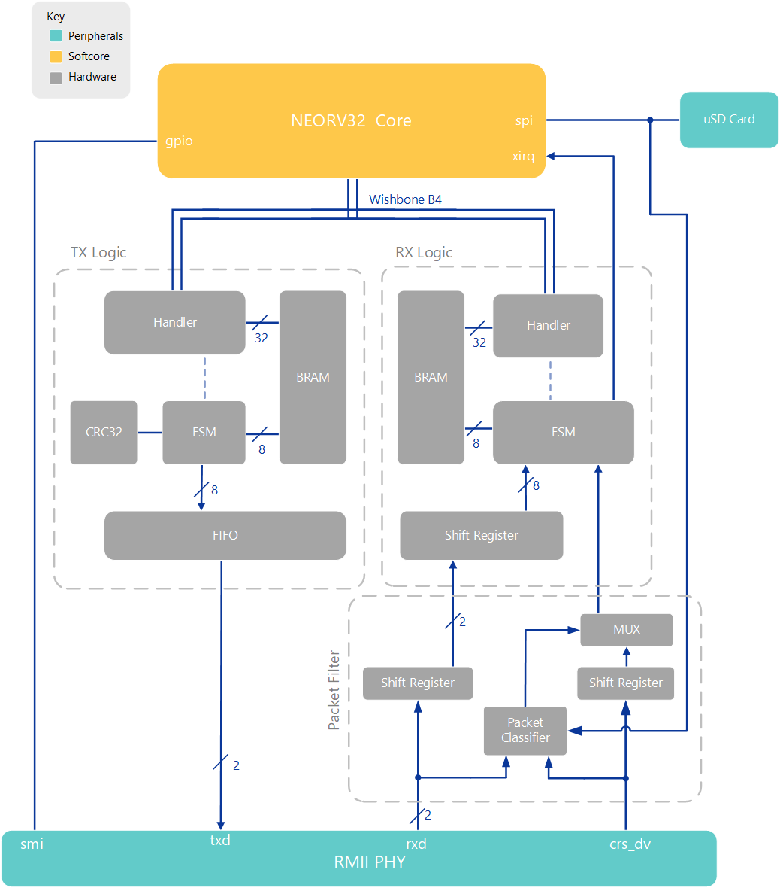
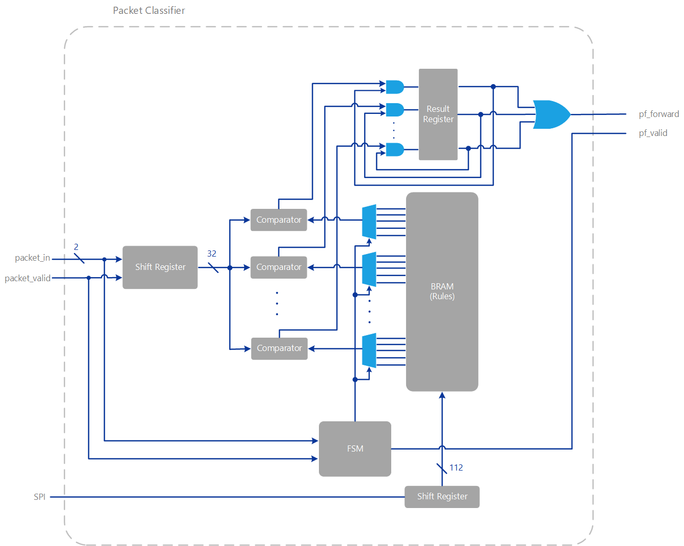
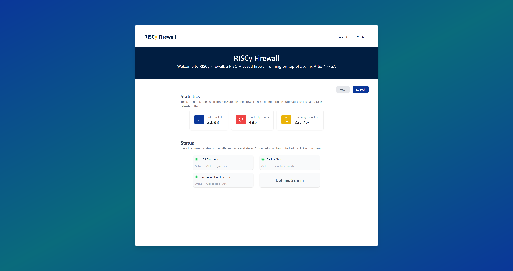

# Thesis
A repository containing my thesis work as part of the Bachelor of Engineering (Honours) degree at The University of Queensland. 

# Overview

This thesis project invloved creating a custom Ethernet Media Access Controller (MAC) and hardware packet filter on a FPGA. A RISC-V softcore (namely the NeoRV32 SoC), would then also be added to the design to run a webserver over the top of FreeRTOS. Layer 3 and above networking was handled by the FreeRTOS-Plus-TCP stack. A webserver (based of the FreeRTOS examples) was also created and use the FreeRTOS-Plus-FAT filesystem library to access files on the microSD card. Drivers for both the Ethernet MAC and SD card were also created. 

Below is a diagram of how the different bits of hardware interact with each other.

# Packet filter
The packet filter is a stateless filter that is capable of filtering packets based on the five common fields. These fields are the: source IP address, destination IP address, source port, destination port and protocol. The architecture can be seen below.

First the packet is sent into a shift register `2` bits wide (coming straight from the RMII interface) at `50MHz`. This then allows the packet to be processed in `32bit` chunks. A FSM keeps track of which byte is currently being processed. It then controls the hardware to perform the filtering. A comparator is used to compare the current `32bits` with part of the rule which is stored in BRAM. The result of this comparison is then ANDed with the current status of the rule and is stored in a register. It needs to be ANDed with the current status (the result of previous comparisons for the rule) to ensure that the whole rule is matched. After all fields have been compared, all bits in the register are ORed together as any bit being 1 means that a rule has been fully matched.

To include this packet filter in the design, the input from the RMII interface is sent into both the packet filter and a shift register of size `224` long by `2bits` wide. This then allows the packet filter to take `224` clock cycles to process the headers (which is the minimum needed for the header plus some buffer). The packet filter then just controls a simple multiplexer to forward or drop the incoming packet. This adds a total delay of `4.48` microseconds.

## Advantages
Some of the advantages of this design include:
- Fast! `4us` to classify packet
- Wirespeed - does not impact throughput. 

## Limitations
The current limitations of the design include:
- Maximum 8 rules (can be expanded)

# Webserver

The firewall has a web dashboard to view statistics and configure the packet filter itself. 

The website was written in Vue.js and using the Tailwindcss framework. 

The website also has an about page where the user can find out about the project. Only 3 main pages were added to this design as a proof of concept. Other webpages can be easily added without worry of size due to the web content being stored on an external MicroSD card.  

# Licensing

This repository contains mixed content under different licenses:

- **Hardware VHDL Code**: The VHDL code located in the *vivado* directory and it's children folders excluding the NEORV32 core found in *vivado/thesis.srcs/sources_1/imports/core* is licensed under a proprietary license that restricts commercial use. The full license text can be found at the beginning of each VHDL file and must be respected as per the terms described therein. See [LICENSE](/LICENSE) for full details.

- **Documentation and Text**: All written content provided outside of the VHDL code directories is licensed under the BSD 3-Clause License, which allows for sharing and adaptation for any purpose, as long as appropriate credit is given. See [LICENSE-docs](/LICENSE-docs) for full details.

Please ensure you comply with the licensing terms for each part of the repository. For any use beyond what is permitted by these licenses, please contact Matthew Gilpin at matt@matthewgilpin.com
